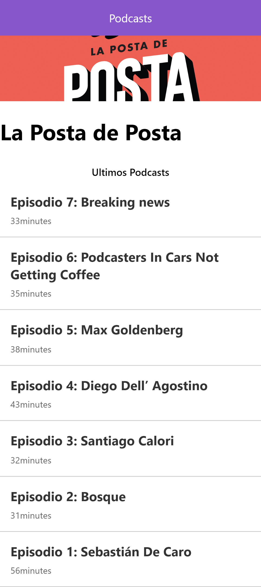

# App de Podcasts 

App integrada con la Api de AudioBoom para practicar Next.js esta adaptado para mobile 

##¿Cómo funciona?

Requiere Node.js

* `npm install` para instalar las dependencias.
* `npm run dev`para el entorno de desarrollo.
* `npm run build && npm start` para el entorno de producción.

##licencia 

MIT.